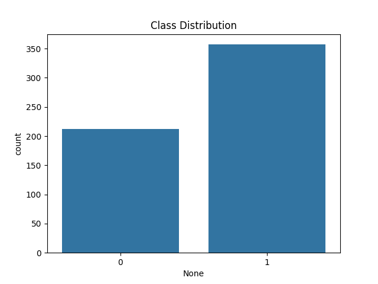
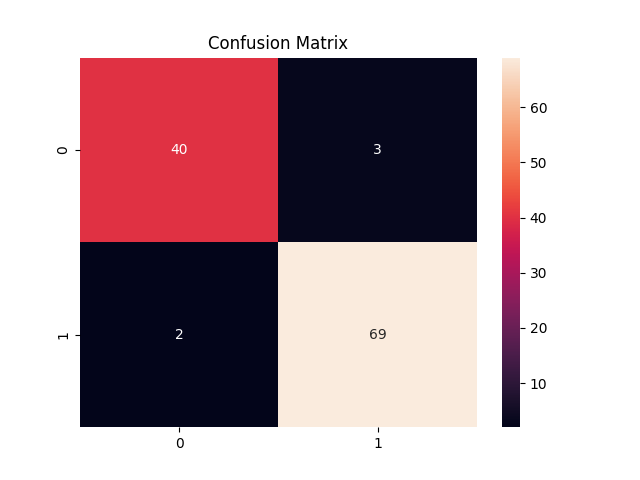

# Breast Cancer Classification using Machine Learning

## 📑 Table of Contents
- [Project Overview](#-project-overview)
- [Dataset](#-dataset)
- [Machine Learning Models](#-machine-learning-models)
- [Evaluation Metrics](#-evaluation-metrics)
- [Results](#-results)
- [Visualizations](#-visualizations)
- [Key Learnings](#-key-learnings)
- [Technologies Used](#-technologies-used)
- [How to Run](#-how-to-run)
- [Author](#-author)

---

## 📌 Project Overview
This project builds an end-to-end machine learning pipeline to classify breast tumors as **malignant** or **benign** using the Breast Cancer dataset from Scikit-learn.

The workflow includes:
- Data exploration and visualization
- Feature selection
- Model training and comparison
- Hyperparameter tuning
- Performance evaluation
- Model interpretation

This project demonstrates a complete supervised machine learning workflow for medical diagnosis.

---

## 📊 Dataset
- Source: Scikit-learn Breast Cancer Dataset  
- Samples: 569  
- Features: 30 numerical features  

Target:
- 0 → Malignant  
- 1 → Benign  

---

## ⚙️ Machine Learning Models
The following models were trained and compared:

- Logistic Regression  
- Support Vector Machine (SVM)  
- Random Forest (tuned with GridSearchCV)  

---

## 🧪 Evaluation Metrics
Models were evaluated using:

- Accuracy  
- Precision  
- Recall  
- F1-score  
- ROC-AUC Score  
- Confusion Matrix  
- ROC Curve  
- Precision-Recall Curve  

---

## 📈 Results
After hyperparameter tuning, **Random Forest** achieved the best performance.

Feature importance analysis identified the most influential predictors for classification.

---

## 🖼 Visualizations

### Class Distribution

### Feature Correlation Heatmap

### Confusion Matrix

### ROC Curve

### Feature Importance

---

## 🧠 Key Learnings
- Importance of data preprocessing and scaling  
- Feature selection improves model performance  
- Hyperparameter tuning enhances accuracy  
- Ensemble models perform strongly in classification tasks  
- Model interpretability helps understand predictions  

---

## 🛠 Technologies Used
- Python  
- Pandas  
- NumPy  
- Matplotlib  
- Seaborn  
- Scikit-learn  

---

## ▶️ How to Run
1. Clone this repository  
2. Install required libraries  
3. Open the Jupyter Notebook  
4. Run all cells  

---

## 📌 Author
Machine Learning Internship Project
